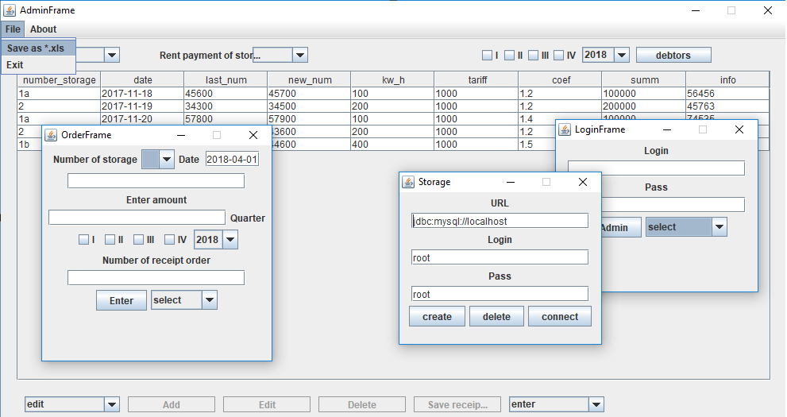

Self-Storage Unit
=================
A small Java desktop project for finance managing of the self-storage unit. 
 
[](https://travis-ci.org/babroval/self-storage-unit)
[](https://github.com/babroval/self-storage-unit/blob/master/LICENSE)
```
		view.getComboNumEdit().addActionListener(new ActionListener() {
			@Override
			public void actionPerformed(ActionEvent ae) {
				view.getGroupStorage().clearSelection();
				if (view.getComboNumEdit().getSelectedIndex() == 0) {
					view.getComboUserEdit().setSelectedIndex(0);
					view.getTfStorageNum().setText("");
					view.getTfStorageInfo().setText("");
				} else {
					try {
						Storage storage = storageService.getByStorageNumber(
								String.valueOf(view.getComboNumEdit().getSelectedItem()));
						User user = userService.getByStorageNumber(
								String.valueOf(view.getComboNumEdit().getSelectedItem()));
						view.getTfStorageNum().setText(storage.getStorage_number());
						view.getTfStorageInfo().setText(storage.getInfo());
						if (user.getUser_id() != 1) {
							view.getComboUserEdit().setSelectedItem(user.getName());
							view.getTfUserName().setText(user.getName());
							view.getTfUserInfo().setText(user.getInfo());
						} else {
							view.getComboUserEdit().setSelectedIndex(0);
						}
					} catch (Exception e) {
						JOptionPane.showMessageDialog(view.getPanel(),
								"database fault", "", JOptionPane.ERROR_MESSAGE);
					}
				}
			}
		});
```

Table of Contents
-----------------
  * [Requirements](#requirements)
  * [Usage](#usage)
  * [Contributing](#contributing)
  * [License](#license)  


Requirements
------------
Self-Storage Unit requires the following to run:
  * [JRE][jre] 8
  * [MySQL Community Server][mysql]  


Usage
-----
Self-Storage Unit is easiest to use with [Eclipse IDE][eclipse]:  
File -> Import -> Git -> Projects From Git > URI

#### Error handling
All exceptions are converted into unchecked type to
keep code clean as possible.
<br/>
<br/>

Contributing
------------
To contribute to Self-Storage Unit, clone this repo locally and  
commit your code on a separate branch.
<br/>
<br/>

License
-------
Self-Storage Unit is licensed under the [MIT][mit] license.  

[jre]: http://www.oracle.com/technetwork/java/javase/downloads/
[mysql]: https://dev.mysql.com/downloads/mysql/
[eclipse]: https://www.eclipse.org/downloads/
[mit]: https://github.com/babroval/self-storage-unit/blob/master/LICENSE/
