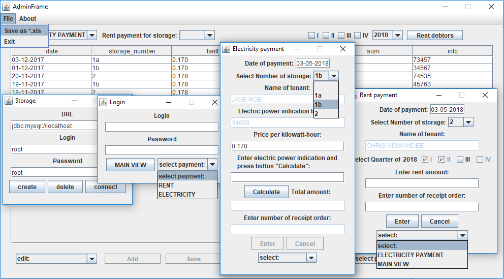

Self-Storage Unit
=================
A small Java desktop project for finance managing of the self-storage unit. 
 
[](https://travis-ci.org/babroval/self-storage-unit)
[](https://github.com/babroval/self-storage-unit/blob/master/LICENSE)
```
private void updateFrame() {
	if (comboNum.getSelectedIndex() == 0) {
		resetFrame();
	} else {
		resetFrame();
		try (Connection cn = ConnectionPool.getPool().getConnection();
			Statement st = cn.createStatement();
			ResultSet rs = st.executeQuery(
				"SELECT user.name, f.storage_id, f.meter_paid, f.tariff"
			 + " FROM storage, user, electric AS f"
			 + " INNER JOIN (SELECT storage_id, MAX(meter_paid) AS maxmeter"
					 	 + " FROM electric"
					 	 + " GROUP BY storage_id) AS temp"
					 	 + " ON f.storage_id=temp.storage_id"
					 	 + " AND f.meter_paid=temp.maxmeter"
			 + " WHERE storage.storage_number='" + comboNum.getSelectedItem()+ "'"
			 + " AND f.storage_id=storage.storage_id"
			 + " AND storage.user_id=user.user_id")) {
			while (rs.next()) {
				tfName.setText(rs.getString(1));
				tfIndicationLastPaid.setText(rs.getString(3));
				tfTariff.setText(rs.getString(4));
			}
				tfTariff.setEnabled(true);
				tfIndication.setEnabled(true);
				calculate.setEnabled(true);
		} catch (Exception e) {
			comboNum.setSelectedIndex(0);
				resetFrame();
				JOptionPane.showMessageDialog(
					panel, "database fault","",JOptionPane.ERROR_MESSAGE);
		}
	}
	panel.updateUI();
}
```

Table of Contents
-----------------
  * [Requirements](#requirements)
  * [Usage](#usage)
  * [Contributing](#contributing)
  * [License](#license)  


Requirements
------------
Self-Storage Unit requires the following to run:
  * [JRE][jre] 8
  * [MySQL Community Server][mysql]  


Usage
-----
Self-Storage Unit is easiest to use with [Eclipse IDE][eclipse]:  
File -> Import -> Git -> Projects From Git > URI

#### Error handling
All exceptions are converted into unchecked type to
keep code clean as possible.
<br/>
<br/>

Contributing
------------
To contribute to Self-Storage Unit, clone this repo locally and  
commit your code on a separate branch.
<br/>
<br/>

License
-------
Self-Storage Unit is licensed under the [MIT][mit] license.  

[jre]: http://www.oracle.com/technetwork/java/javase/downloads/
[mysql]: https://dev.mysql.com/downloads/mysql/
[eclipse]: https://www.eclipse.org/downloads/
[mit]: https://github.com/babroval/self-storage-unit/blob/master/LICENSE/
